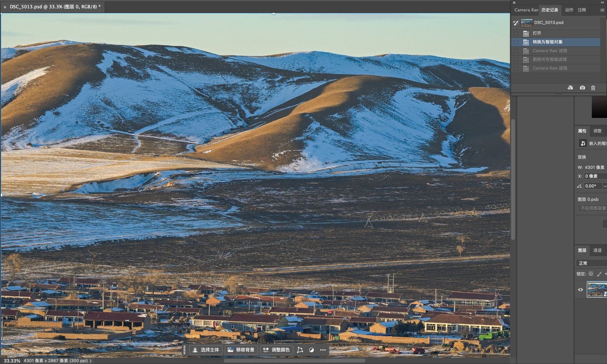
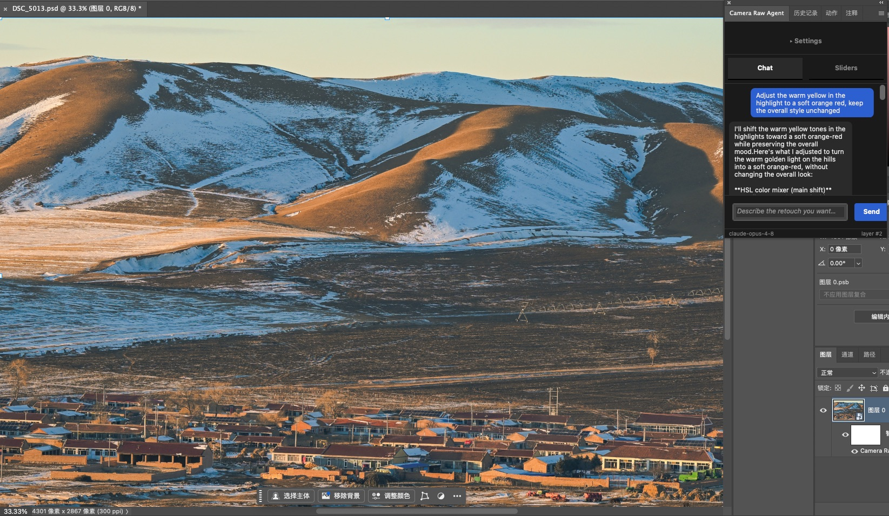
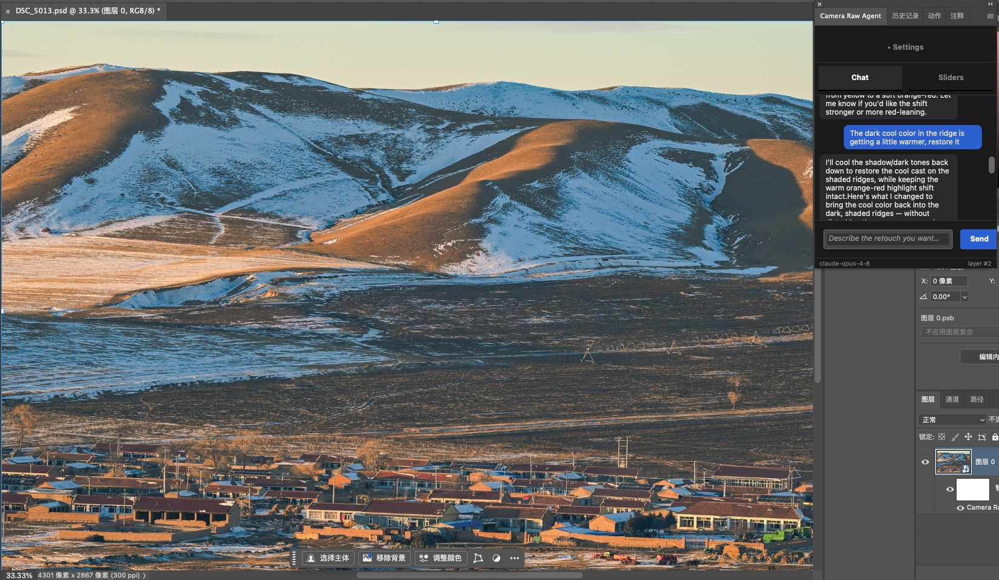

# Camera Raw Agent

A Photoshop UXP plugin — multimodal LLM retouch assistant for photographers, bloggers, and visual designers.

## Requirements

1.Requires Photoshop 2024+.
2.Run it insidePhotoshop via the UXP Developer Tool (below). — free, from
   <https://developer.adobe.com/photoshop/uxp/2022/guides/devtool/installation/>.
3. Set a Anthropic API key to call the Claude model.

##  Using the Plugin

1. **Install the UXP Developer Tool (UDT)** 
2. **Add the plugin in UDT** → *Add Plugin* → select
   `camera-raw-agent/manifest.json` (the repo root manifest; it points
   `main` at `dist/index.js`).
3. **Load** → UDT pushes the plugin into the running Photoshop instance.
   In Photoshop: **Plugins menu → Camera Raw Agent** opens the panel.
4. **Debug** → click *Debug* next to the loaded plugin in UDT to open
   Chrome DevTools (console, breakpoints, network) attached to the panel.
5. **Set API key.** On first run, store your Anthropic API key in the
   panel's settings (saved to UXP secure storage under `anthropic_api_key`).
6. **Iterate** → edit code → webpack rebuilds `dist/` → click *Reload* in
   UDT. No Photoshop restart needed.
7. **Open an image** and **select the layer** you want to retouch — the
   top-most selected layer is the active target.
8. **Chat tab — describe the edit** in plain language
   (e.g. *"lower the exposure a bit and warm up the whites"*) and press
   **Send**. The plugin exports the layer as a PNG, sends it with your
   instruction to Claude, and streams the response.
9. **Review the preview.** When the model proposes adjustments, an
   **XMP Preview card** shows the parameters. Click **Apply** to commit them
   to the layer via Camera Raw, or **Discard** to reject.
10. **Sliders tab — manual control.** Adjust Camera Raw-style sliders
   (Basic / Color Grading / Calibration) directly, then **Apply to Layer**.
   Both panels share the same XMP state.

## Examples
**Before**:

**Input**: Adjust the warm yellow in the highlight to a soft orange red, keep the overall style unchanged. 

**Retouch**:

**Input**: The dark cool color in the ridge is getting a little warmer, restore it.

**Retouch**:

